# Команда kotyari: проект [OXIC](https://oxic.shop)

## 1. Оформление заказа

Тестовое окружение:
masOS Chrome 133.0.6943.142

+ При нажатии на кнопку "Заказать", открывается страница "Мои заказы", заказ добавлется; ✅

+ При оформлении множества товаров появляется скролл; ✅
  
+ При оформлении нескольких товаров сумма заказа рассчитывается верно; ✅

+ При выборе способа оплаты наличными заказ успешно оформляется; ✅
+ При выборе способо оплаты картой заказ успешно оформляется; ✅
+ После оформления заказа, при возврате на страницу оформления создается пустой заказ; ❌

> [БАГ] Пустой заказ
>
> Ожидаемый результат: пустая страница оформления заказов
>
> Фактический результат: на странице оформления заказов создается пустой заказ
> 
> 

+ Оформление пустого заказа не валидируется и открывает страницу заказов; ❌
> [БАГ] Оформление пустого заказа
>
> Ожидаемый результат: не удается оформить пустой заказ
>
> Фактический результат: оформление пустого заказа редиректит на страницу заказов
> 

+ Промокод успешно применяется; ✅
  

+ При вводе несуществующего промокода отображается соответствующее сообщений; ✅
  

+ При повторном применении промокода нет валидации; ❌
> [БАГ] Повторное применение промокода
>
>

>
>

## 2. Вишлисты

Тестовое окружение - macOS Sequoia 15.3, Brave 1.76.74 - Chromium 134.0.6998.89 (Official build for arm64)

* При отсутствии вишлистов корректно отображается соответствующая надпись. ✅
  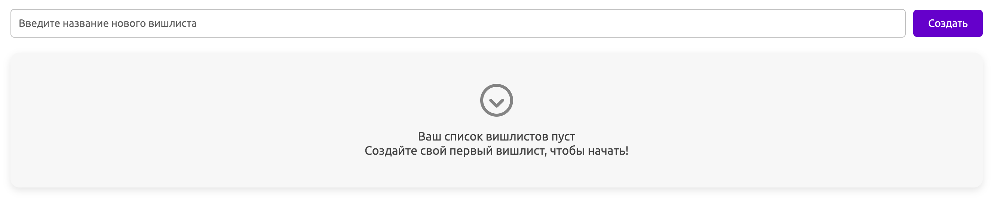

* При нажатии на кнопку создать успешно создается вишлист, выводится соответствующее уведомление. ✅
  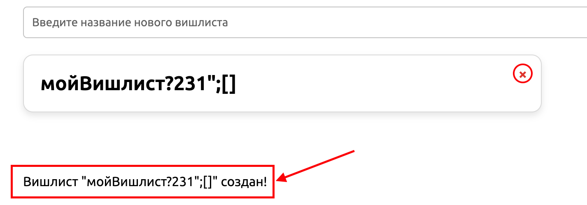

* При попытке создать вишлист с пустым названием, выводится соответствующее уведомление. ✅

* При создании вишлиста не контролируется длина названия. ❌

> [БАГ] Слетает верстка при слишком длинном названии.
>
> Ожидаемый результат: Контроль длины названия в виде уведомления, либо корректное отображение длинных названий.
>
> Фактический результат: Ломается верстка при слишком длинном названии.
> 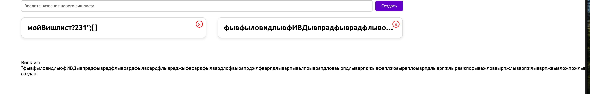
> 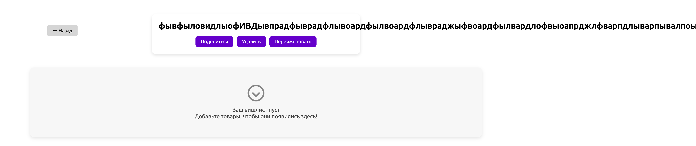

* При отсутствии товаров в вишлисте отображается соответствующая надпись. ✅
  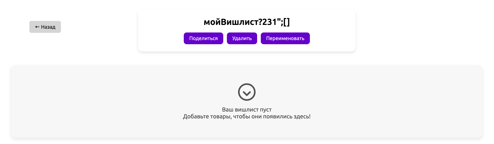

* При переименовании вишлиста и нажатии кнопки "Enter" на клавиатуре вишлист успешно переименовывается. Соответствующее уведомление отображается. ✅

* При переименовании вишлиста и повторном нажатии кнопки переименовать, название сбрасывается. ❌

> [БАГ] При переименовании вишлиста с нажатием кнопки переименовать, текущее название сбрасывается, а обновленное появляется только после перезагрузки страницы.
>
> Ожидаемый результат: Успешное переименование вишлиста.
>
> Фактический результат: Сброс названия.
> 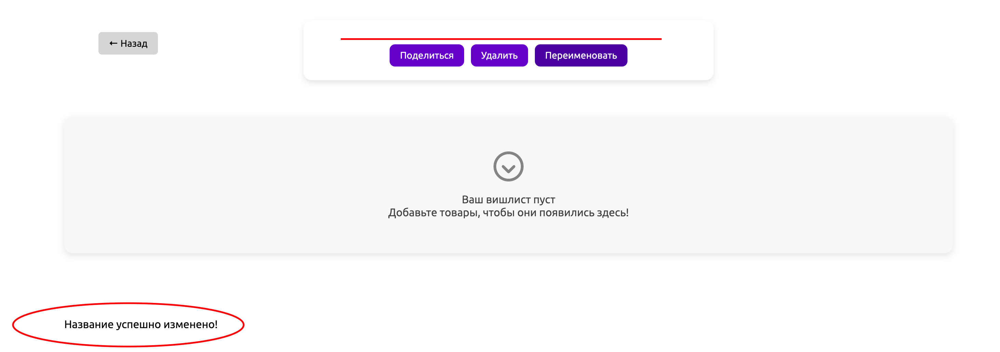

* При нажатии на кнопку удаления в главном меню, а также в меню вишлиста, он корректно удаляется. Сообщение об удалении выводится. ✅
  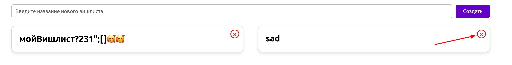
  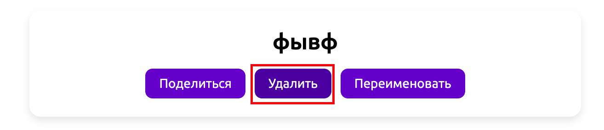
  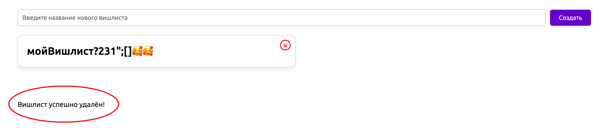

* При добавлении продукта в вишлист, отображаются все доступные вишлисты. Добавление происходит корректно. ✅
  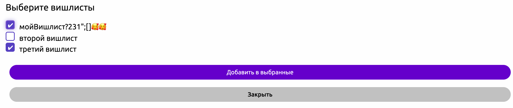
* При нажатии на товар в вишлисте происходит корректный переход на страницу товара. ✅
* При нажатии на кнопку удаления товар не удаляется. ❌
> [БАГ] При нажатии на кнопку удаления товар не удаляется.
>
> Ожидаемый результат: Удаление товара из вишлиста.
>
> Фактический результат: Переход на страницу товара.
> 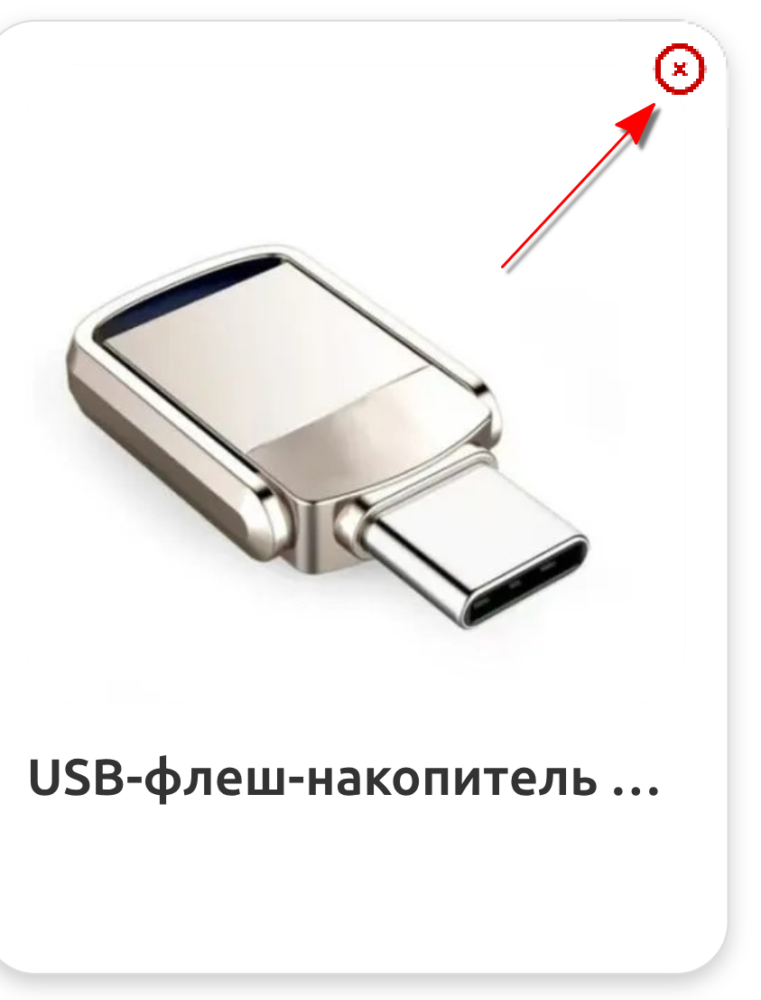

* При нажатии на кнопку поделиться, ссылка успешно копируется. Отображается уведомление. ✅
* При попытке заходе по ссылке в статусе создателя, все управляющие элементы доступны. ✅
* При попытке заходе по ссылке в статусе неавторизованного пользователя, недоступны управляющие кнопки. ✅
* При попытке заходе по ссылке в статусе другого авторизованного пользователя, недоступны управляющие кнопки. ✅
* При попытке заходе по ссылке в статусе неавторизованного пользователя или другого авторизованного пользователя, отображается неработающая кнопка удаления товара. ❌
* > [БАГ] При попытке заходе по ссылке в статусе неавторизованного пользователя, кнопка манипуляции с товарами в вишлисте не должна отображаться.
>
> Ожидаемый результат: Отсутствие кнопки удаления у товара.
>
> Фактический результат: Отображение кнопки удаления товара.
> 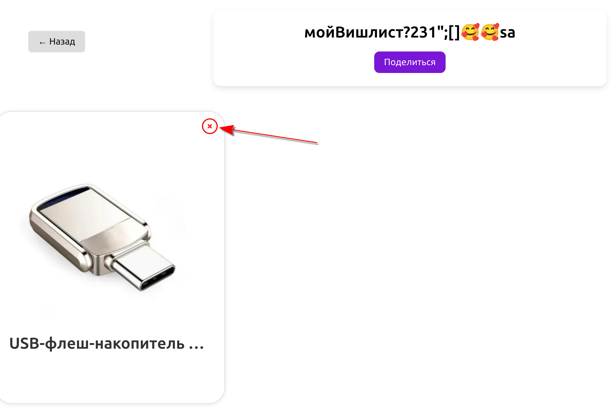