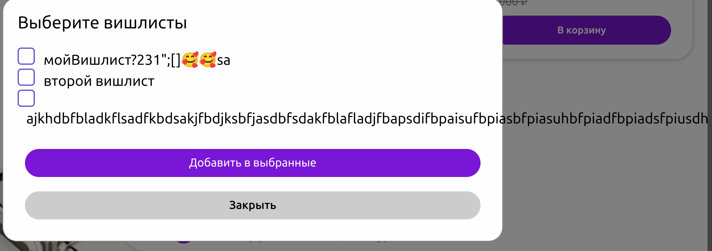

# Команда kotyari: проект [OXIC](https://oxic.shop)

## 1. Оформление заказа

Тестовое окружение:
masOS Chrome 133.0.6943.142

+ При нажатии на кнопку "Заказать", открывается страница "Мои заказы", заказ добавлется; ✅

+ При оформлении множества товаров появляется скролл; ✅
  
+ При оформлении нескольких товаров сумма заказа рассчитывается верно; ✅

+ При выборе способа оплаты наличными заказ успешно оформляется; ✅
+ При выборе способо оплаты картой заказ успешно оформляется; ✅
+ После оформления заказа, при возврате на страницу оформления создается пустой заказ; ❌

> [БАГ] Пустой заказ
>
> Ожидаемый результат: пустая страница оформления заказов
>
> Фактический результат: на странице оформления заказов создается пустой заказ
> 
> 

+ Оформление пустого заказа не валидируется и открывает страницу заказов; ❌
> [БАГ] Оформление пустого заказа
>
> Ожидаемый результат: не удается оформить пустой заказ
>
> Фактический результат: оформление пустого заказа редиректит на страницу заказов
> 

+ Промокод успешно применяется; ✅
  

+ При вводе несуществующего промокода отображается соответствующее сообщений; ✅
  

+ При повторном применении промокода нет валидации; ❌
> [БАГ] Повторное применение промокода
>
> Ожидаемый результат: сообщение "Данный промокод уже применен"
>
> Фактический результат: "Отображение зачеркнутой той же цены"
> 

+ Нельзя отменить применение промокода; ❌
> [БАГ] Повторное применение промокода
>
> Ожидаемый результат: сообщение "Данный промокод уже применен"
>
> Фактический результат: "Отображение зачеркнутой той же цены"

+ Нельзя выбрать адрес доставки; ❌
+ При нажатии на кнопку рядом с адресом открывается страница профиля; ❌
> [БАГ] При нажатии на кнопку рядом с адресом открывается страница профиля
>
> Ожидаемый результат: Можно выбрать адрес доставки на странице оформления
>
> Фактический результат: Открывается страница профиля, где я могу поставить свой адрес
> 
> 

+ При оформлении множества товаров правильно рассчитывается их количество ✅

+ При большом количестве символов в имени съезжает строка получатель; ❌
> [БАГ] Неккоректно отображается имя получателя
>
> Ожидаемый результат: Имя выравнено с адресом доставки
>
> Фактический результат: Имя съезжает в строке информации о получателе

+ При длинном адресе съезжает верстка; ❌
> [БАГ] Неккоректно отображается адрес доставки
>
> Ожидаемый результат: Адрес доставки не вылезает за пределы блока
>
> Фактический результат: Адрес доставки вылезает за блок

+ Длинный промокод не нарушает верстку; ✅

+ Странно отображается вес товаров, появляется погрешность у чисел с плавающей запятой. ❌
> [БАГ] Неккоректно отображается вес товаров
>
> Ожидаемый результат: результат веса округлен до 1-2 знаков после запятой
>
> Фактический результат: Появляется длинное значние веса с погрешностью

## 2. Вишлисты

Тестовое окружение - macOS Sequoia 15.3, Brave 1.76.74 - Chromium 134.0.6998.89 (Official build for arm64)

* При отсутствии вишлистов корректно отображается соответствующая надпись. ✅
  

* При нажатии на кнопку создать успешно создается вишлист, выводится соответствующее уведомление. ✅
  

* При попытке создать вишлист с пустым названием, выводится соответствующее уведомление. ✅

* При создании вишлиста не контролируется длина названия. ❌

> [БАГ] Слетает верстка при слишком длинном названии.
>
> Ожидаемый результат: Контроль длины названия в виде уведомления, либо корректное отображение длинных названий.
>
> Фактический результат: Ломается верстка при слишком длинном названии.
> 
> 

* При отсутствии товаров в вишлисте отображается соответствующая надпись. ✅
  

* При переименовании вишлиста и нажатии кнопки "Enter" на клавиатуре вишлист успешно переименовывается. Соответствующее уведомление отображается. ✅

* При переименовании вишлиста и повторном нажатии кнопки переименовать, название сбрасывается. ❌

> [БАГ] При переименовании вишлиста с нажатием кнопки переименовать, текущее название сбрасывается, а обновленное появляется только после перезагрузки страницы.
>
> Ожидаемый результат: Успешное переименование вишлиста.
>
> Фактический результат: Сброс названия.
> 

* При нажатии на кнопку удаления в главном меню, а также в меню вишлиста, он корректно удаляется. Сообщение об удалении выводится. ✅
  
  
  

* При добавлении продукта в вишлист, отображаются все доступные вишлисты. Добавление происходит корректно. ✅
  
* При слишком длинном названии вишлиста в меню добавления ломается верстка. ❌
> [БАГ] При слишком длинном названии вишлиста ломается верстка.
> Ожидаемый результат: Многоточие вместо непомещающихся символов / ограничение длины строки.
> 
> Фактический результат: Название не помещается, верстка съезжает.
> 

* При нажатии на товар в вишлисте происходит корректный переход на страницу товара. ✅
* При нажатии на кнопку удаления товар не удаляется. ❌
> [БАГ] При нажатии на кнопку удаления товар не удаляется.
>
> Ожидаемый результат: Удаление товара из вишлиста.
>
> Фактический результат: Переход на страницу товара.
> 

* При нажатии на кнопку поделиться, ссылка успешно копируется. Отображается уведомление. ✅
* При попытке заходе по ссылке в статусе создателя, все управляющие элементы доступны. ✅
* При попытке заходе по ссылке в статусе неавторизованного пользователя, недоступны управляющие кнопки. ✅
* При попытке заходе по ссылке в статусе другого авторизованного пользователя, недоступны управляющие кнопки. ✅
* При попытке заходе по ссылке в статусе неавторизованного пользователя или другого авторизованного пользователя, отображается неработающая кнопка удаления товара. ❌
* > [БАГ] При попытке заходе по ссылке в статусе неавторизованного пользователя, кнопка манипуляции с товарами в вишлисте не должна отображаться.
>
> Ожидаемый результат: Отсутствие кнопки удаления у товара.
>
> Фактический результат: Отображение кнопки удаления товара.
> 

## 3. Профиль

Тестовое окружение:

macOS Safari версия 17.6 (19618.3.11.11.5)

* Кнопка профиля подписывается именем, которое было указано при регистрации ✅
* При нажатии на кнопку Личный Кабинет открывается личный кабинет, данные, введенные при регистрации, совпадают с данными в профиле ✅
* По умолчанию устанавливается мужской пол ❌

* При нажатии на кнопку Редактировать выходит модальное окно, позволяющее поменять данные ✅ - относится ко всем модалкам
  

* Изменения, введенные в модалке, применяются в аккаунте ✅
* Если в поле имени вводится слишком длинный текст, он корректно отображается в секции с пользовательскими данными, а под кнопкой профиля отображается в сокращённом виде с добавлением многоточия ✅
  

* При вводе слишком длинного (или однобуквенного - Японцам обидно) имени под строкой ввода отображается сообщение о допустимой длине ✅
  

* Можно сохранить адрес электронной почты, содержащий одновременно латинские и русские символы, несмотря на его недопустимость ❌
> [БАГ] Допущение невалидного почтового адреса
>
> Ожидаемый результат: вывод сообщения о допустимом формате
>
> Фактический результат: можно сохранить адрес электронной почты, содержащий одновременно латинские и русские символы, несмотря на его недопустимость
> 

* При вводе длинного адреса падает верстка ❌
  

* Выбран адрес из списка предложенных, нет возможности сохранить, выходит сообщение про валидацию ❌
> [БАГ] Невозможно сохранить адрес
>
> Ожидаемый результат: можно выбрать и сохранить адрес
>
> Фактический результат: нет возможности сохранить адрес, система его считает невалидным
> 

* Есть возможность сохранить невалидный адрес, например, ахахаахха ❌
> [БАГ] Можно сохранить невалидный адрес
>
> Ожидаемый результат: можно выбрать и сохранить только валидный адрес
>
> Фактический результат: длительное время не выходит список предложенных адресов, из-за чего пользователь может сохранить невалидный адрес
> 

* Иногда есть возможность установить адрес из списка предложенных ✅
  

* Можно дополнить адрес до некорректного (несуществующего)  ❌
> [БАГ] Можно сохранить невалидный адрес
>
> Ожидаемый результат: можно выбрать и сохранить только валидный адрес
>
> Фактический результат: длительное время не выходит список предложенных адресов, из-за чего пользователь может сохранить невалидный адрес, а именно дополненный некорректными данными предыдущий
> 

* Если совершить заказ, информация об этом отображается на странице профиля ✅
  

* Корректный переход к странице с вишлистами при нажатии на Смотреть - аналогично с заказами ✅
  
  
  

* Есть возможность сохранить имя, состоящее из букв разных алфавитов - изначально была задумка никнеймов, цифры допустимы ✅
* Есть возможность добавить аватарку ✅
  

* В качестве аватарки может быть гифка ✅
  

* При попытке сохранить в качестве аватарки файл с расширением .png/.jpeg, который по факту является документом другого формата, выходит сообщение об ошибке (при этом остается прежняя аватарка) ✅
  

* Сообщение об ошибке сохраняется на длительное время, даже когда пользователь загружает следующую корректную аватарку ❌  
  

* Гифка размером 2028 кб не загружается в качестве аватарки, никакого сообщения о неудачной попытке сохранить аватарку нет ❌
* Кнопка Выход работает корректно, производится переход на главную страницу и при нажатии на кнопку профиля выходит предложение авторизоваться ✅ 
